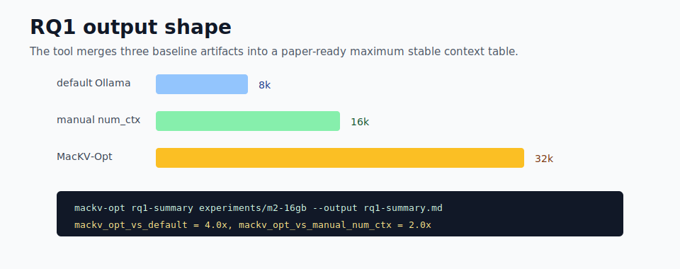

# MacKV-Opt

[English](README.md) | [简体中文](README.zh-CN.md)

MacKV-Opt 是一个面向 Apple Silicon Mac 本地大模型推理的优化工具。它不修改用户选择的模型，不上传数据，也不要求重新量化模型；它围绕 Ollama 和 llama.cpp 的现有能力，估算模型权重、KV cache、上下文长度和统一内存压力，并生成更稳妥的运行策略与论文实验 artifact。




## 项目有效性

这个仓库不是单纯的想法说明，而是可以运行的研究 artifact。当前代码库已经包含 Python 包、CLI 入口、planner 测试、macOS profiler 测试、benchmark/report 测试、GitHub Actions smoke 检查，以及真实 Mac 实验操作清单。上方三张图分别展示已经实现的流程、验证快照和三套 baseline 汇总后的 RQ1 表格形态。

当前已经验证：

- planner 和报告逻辑可通过 `python -m pytest -q` 验证；
- profile、doctor、plan、run、bench、collect、report、compare、baseline-template、RQ1 summary、Needle 和 QA 都有非执行 smoke 路径；
- 可以自动生成 default Ollama、manual `num_ctx`、MacKV-Opt 三套 baseline artifact 目录；
- benchmark 日志中已经包含 macOS memory pressure、swap 和 `vm_stat` 采样字段。

仍需在真实硬件上完成后才能写入论文性能结论：

- 在 16GB、32GB、64GB Apple Silicon Mac 上执行真实 Ollama 实验；
- 测量三套 baseline 的最大稳定上下文、tokens/s、首 token 延迟、峰值 RSS、swap/pageout delta 和质量保持结果。

## 仓库展示信息

- About：KV cache and context planner for running longer local LLM contexts on Apple Silicon Macs with Ollama-compatible benchmarks.
- Homepage：<https://github.com/Lin-Aurora/MacKV-Opt#readme>
- Topics：`apple-silicon`、`ollama`、`llama-cpp`、`kv-cache`、`local-llm`、`llm-inference`、`macos`、`benchmark`、`long-context`、`mlx`、`gguf`、`research-artifact`。

同一份设置记录在 [docs/GITHUB_REPOSITORY_METADATA.md](docs/GITHUB_REPOSITORY_METADATA.md)，方便仓库管理员在 GitHub Settings 中同步；环境中有 GitHub token 时，也可以用 `python scripts/sync_github_metadata.py --apply` 应用。

## 目标

MacKV-Opt 解决的是 Mac 本地运行大模型时最常见的一组问题：

- 长上下文会让 KV cache 线性增长，容易触发 memory pressure、swap 和 tokens/s 断崖。
- Ollama 易用，但默认上下文、手动 `num_ctx`、底层 cache 参数之间缺少可复现实验闭环。
- 用户希望保留原模型，只调整运行策略，而不是重新量化或换模型。
- 论文需要固定 artifact：硬件信息、模型元数据、运行矩阵、质量任务、内存采样和对照表。

## 安装

```bash
python -m pip install -e .
python -m pip install -e ".[dev]"
```

不安装也可以直接运行：

```bash
python -m mackv_opt.cli --help
```

## 快速开始

```bash
mackv-opt doctor
mackv-opt plan llama3.1:8b --target-context 64k --memory-budget 12GiB
mackv-opt baseline-template \
  --output-dir experiments/m2-16gb \
  --models llama3.1:8b \
  --contexts 8k,16k,32k \
  --memory-budget 12GiB
mackv-opt experiment llama3.1:8b \
  --contexts 8k,16k,32k \
  --memory-budget 12GiB \
  --dry-run --json
```

真实 Mac 实验请从这份清单开始：
[docs/REAL_MAC_EXPERIMENT_CHECKLIST.md](docs/REAL_MAC_EXPERIMENT_CHECKLIST.md)

## 核心命令

检测本机和运行环境：

```bash
mackv-opt doctor --json
mackv-opt profile --json
mackv-opt capabilities --json
```

生成优化计划：

```bash
mackv-opt plan llama3.1:8b \
  --target-context 64k \
  --memory-budget 20GiB
```

生成三套 baseline 目录：

```bash
mackv-opt baseline-template \
  --output-dir experiments/m2-16gb \
  --models llama3.1:8b,qwen2.5:7b \
  --contexts 8k,16k,32k \
  --memory-budget 12GiB \
  --json
```

执行 benchmark：

```bash
mackv-opt bench \
  --models llama3.1:8b \
  --contexts 8k,16k,32k \
  --execute --json \
  --repeats 3 \
  --stable-context-policy all \
  --include-memory-series \
  --output-dir experiments/m2-16gb \
  --output-prefix llama3-8b-longctx
```

生成 RQ1 论文表：

```bash
mackv-opt rq1-summary experiments/m2-16gb \
  --output experiments/m2-16gb/rq1-summary.md
```

## 实验输出

MacKV-Opt 可以生成：

- `collect/manifest.json` 和 `collect-audit.json`
- `doctor.json`、`machine-profile.json`、`runtime-capabilities.json`
- `default/full-run.json`
- `manual-num-ctx/full-run.json`
- `mackv-opt/full-run.json`
- context/performance/memory/quality/stability 表
- RQ1 汇总表
- memory SVG 曲线

macOS 上的可执行 benchmark 会记录：

- tokens/s 和首 token 延迟代理指标
- Ollama process RSS 峰值
- memory pressure
- swap delta
- `vm_stat` pagein/pageout/swapin/swapout delta
- Needle 和 QA 质量检查结果

## 安全和隐私

MacKV-Opt 是本地工具：

- 不修改、替换或重新量化用户模型。
- 不上传 prompt、输出、硬件信息或实验日志。
- 默认 dry-run，不会自动启动真实推理。
- 只有用户明确加 `--execute` 时才调用本地 Ollama API。

## 当前状态

当前仓库包含 CLI、测试、CI、真实 Mac 实验清单和论文 artifact 生成流程。项目已经可以用于 dry-run、artifact 准备、baseline 对照目录生成、RQ1 表格汇总和本地 Ollama API benchmark。

真实性能结论仍需要在 16GB、32GB、64GB Apple Silicon Mac 上按清单执行后再写入论文。

## 开发

```bash
python -m pytest -q
```

GitHub Actions 会在 Ubuntu 和 macOS 上运行测试与 CLI smoke，不需要下载模型。
