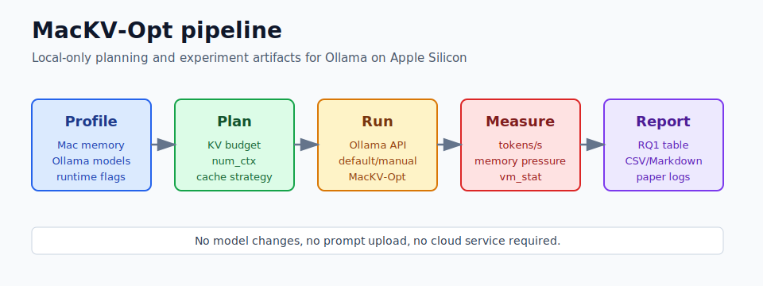
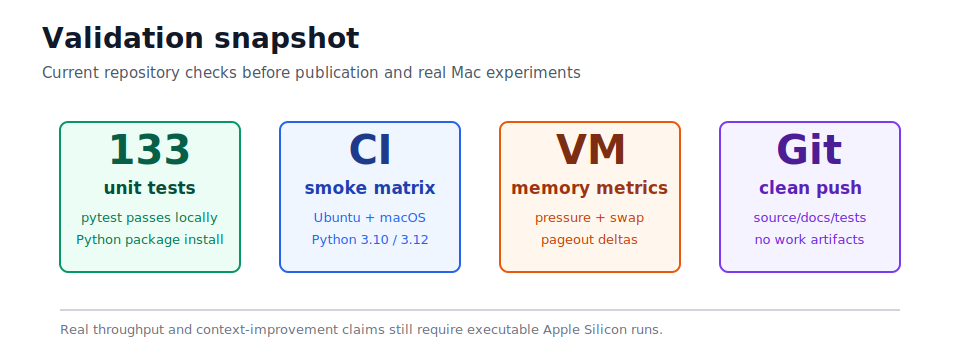
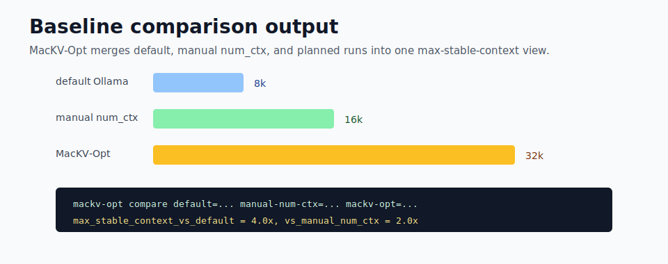

# MacKV-Opt

[English](README.md) | [简体中文](README.zh-CN.md)

MacKV-Opt 是一个面向 Apple Silicon Mac 本地大模型推理的优化工具。它不改变用户选择的模型，不上传 prompt 或输出，帮助 Ollama 用户减少 memory pressure、swap 卡顿和反复试 `num_ctx` 的成本。







## 优化什么

长上下文推理会让 KV cache 随上下文长度近似线性增长。在统一内存 Mac 上，过大的上下文容易触发 memory pressure 和 swap；过小的上下文又浪费可用内存，迫使用户缩短输入。

MacKV-Opt 的作用是：

- 估算模型权重、KV cache、运行时开销和内存余量；
- 按用户给定的内存预算选择更稳妥的 `num_ctx`；
- 在 llama.cpp 可用时给出 KV cache 类型和 offload 参数建议；
- 提醒 Ollama、llama.cpp、模型元数据或内存采样能力是否缺失；
- 用同一个模型和 prompt 对比 default Ollama、manual `num_ctx` 和 MacKV-Opt。

它不是凭空加速器。它的优化效果来自更准确地使用本机内存预算：减少长上下文失败、降低 swap 导致的速度断崖，并在有内存余量时让可用上下文更长。

## 快速开始

安装：

```bash
python -m pip install -e .
```

检查机器：

```bash
mackv-opt doctor
```

最简单的自动规划：

```bash
mackv-opt auto llama3.1:8b --memory-budget 12GiB
```

需要调用本地 Ollama 时再加 `--execute`：

```bash
mackv-opt auto llama3.1:8b \
  --memory-budget 12GiB \
  --prompt "Summarize this document" \
  --execute
```

规划指定上下文：

```bash
mackv-opt plan llama3.1:8b --target-context 64k --memory-budget 12GiB
```

Ollama 元数据不完整时，可以手动补充：

```bash
mackv-opt plan llama3.1:8b \
  --target-context 64k \
  --memory-budget 12GiB \
  --model-size 4.8GiB \
  --hidden-size 4096 \
  --layers 32 \
  --heads 32 \
  --kv-heads 8 \
  --hardware-memory 16GiB
```

## 原理

核心估算：

```text
estimated_total = model_weights + KV_cache(context, layers, hidden, GQA_ratio, KV_type) + runtime_overhead
```

planner 会从目标上下文向下搜索，选择能放进内存预算的最大配置。内存足够时优先使用质量更高的 KV cache 类型；内存紧张时再切换到更紧凑的类型；仍然放不下时才降低上下文。

对 Ollama，MacKV-Opt 输出 `num_ctx` 和 `num_gpu` 选项。对 llama.cpp，它还会输出 `--ctx-size`、`--cache-type-k`、`--cache-type-v` 和 `--kv-offload` 参数。

## 和其他方式对比

| 方式 | 用户怎么做 | 主要问题 | MacKV-Opt 的作用 |
| --- | --- | --- | --- |
| Default Ollama | 直接运行模型 | 上下文可能不适合当前任务和内存 | 记录默认对照 |
| 手动 `num_ctx` | 凭经验填写上下文 | 容易超内存或浪费余量 | 先估算再运行 |
| llama.cpp 参数 | 直接调底层参数 | 参数强但容易配错 | 把内存预算转换成具体参数 |
| MLX/其他运行时 | 换推理栈 | 可能改变模型格式或工作流 | 保留 Ollama 优先工作流 |
| KV 压缩库 | 接入专门算法 | 常需要改运行时代码 | 先复用现有运行时能力 |

## 验证优化效果

生成三套可对比目录：

```bash
mackv-opt baseline-template \
  --output-dir experiments/m2-16gb \
  --models llama3.1:8b \
  --contexts 8k,16k,32k \
  --memory-budget 12GiB
```

分别运行这些目录里的 `run.sh`：

```text
experiments/m2-16gb/llama3.1-8b/default/
experiments/m2-16gb/llama3.1-8b/manual-num-ctx/
experiments/m2-16gb/llama3.1-8b/mackv-opt/
```

汇总对比：

```bash
mackv-opt compare \
  default=experiments/m2-16gb/llama3.1-8b/default/full-run.json \
  manual-num-ctx=experiments/m2-16gb/llama3.1-8b/manual-num-ctx/full-run.json \
  mackv-opt=experiments/m2-16gb/llama3.1-8b/mackv-opt/full-run.json \
  --baseline-label default \
  --format markdown
```

多模型矩阵：

```bash
./scripts/run_macos_matrix.sh
MACKV_EXECUTE=1 MACKV_MEMORY_BUDGET=20GiB ./scripts/run_macos_matrix.sh
```

16GB、32GB、64GB 的验证预设见 [docs/MAC_VALIDATION_CHECKLIST.md](docs/MAC_VALIDATION_CHECKLIST.md)。

## 没有 Mac 怎么测试

没有 Apple Silicon Mac 时仍然可以完成大部分开发验证：

- 在 Windows 或 Linux 上运行 `python -m pytest -q`；
- 用手动 metadata 和 `--hardware-memory` 测 planner；
- 用 `--dry-run` 跑 `bench`、`experiment`、`needle`、`qa`；
- 用 fixture JSON 生成 baseline 目录和 compare 报告；
- 用 GitHub Actions 的 macOS runner 做打包和 CLI smoke；
- 借用、租用或接入 self-hosted Apple Silicon Mac 做可执行 Ollama 验证。

非 Mac 环境不能证明 Apple 统一内存压力、Metal 路径、Ollama tokens/s 和目标 Mac 的最大稳定上下文。这些必须在安装了 Ollama 和目标模型的 Apple Silicon Mac 上测。

## 常用命令

```bash
mackv-opt profile --json
mackv-opt doctor --json
mackv-opt capabilities --json
mackv-opt collect --output-dir experiments/m2-16gb/collect --models llama3.1:8b --json
mackv-opt audit experiments/m2-16gb/collect/manifest.json --json
mackv-opt auto llama3.1:8b --memory-budget 12GiB
mackv-opt run llama3.1:8b --target-context 64k --memory-budget 12GiB
mackv-opt bench --models llama3.1:8b --contexts 8k,16k,32k --dry-run --json
mackv-opt experiment llama3.1:8b --contexts 8k,16k,32k --memory-budget 12GiB --dry-run --json
mackv-opt report full-run.json --table performance
mackv-opt plot-memory full-run.json --output memory-series.svg
```

`run`、`bench`、`needle`、`qa` 和 `experiment` 只有在传入 `--execute` 时才会调用本地推理。

## 安全和隐私

- 不替换模型。
- 不改写权重。
- 不自动重新量化。
- 不依赖云服务。
- 不上传 prompt 或输出。
- 不持久修改 Ollama 配置，除非用户执行打印出来的命令或主动传入 `--execute`。

## 开发

```bash
python -m pip install -e ".[dev]"
python -m pytest -q
```

CI 会在 Ubuntu 和 macOS 上验证打包、单元测试和非执行 CLI smoke，不下载模型，也不调用 Ollama 推理。
